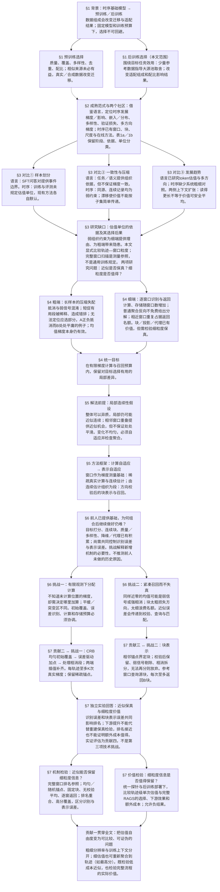

# Intro 完整结构 DAG

两项技术挑战对应计算与表示两项方法贡献；实验是独立回答层，不作为第三项技术挑战。研究缺口处提前提出保真与价值问题。

```mermaid
flowchart TD
    A["§1 背景：时序基础模型 → 预训练／后训练<br/>数据组成会改变迁移与适配结果；固定模型和训练预算下，选择不可回避。"]
    B1["§1 预训练选择<br/>质量、覆盖、多样性、去重、配比；相似来源未必有益，真实／合成数据改变迁移。"]
    B2["§1 后训练选择（本文范围）<br/>围绕目标任务效用：少量参考数据指导大源池取舍；改变适配组成和配比影响结果。"]
    C["§2 成熟范式与两个社区：借鉴语言，定位时序发展<br/>梯度／影响、嵌入／分布、多样性、验证损失、多方向梯度；时序已有窗口、块、尺度与在线方法。表1a／1b保留阶段、依据、单位分类。"]
    D1["§3 对比① 样本划分<br/>语言：SFT问答对提供事件边界。时序：训练与评测未规定估值单位，现有方法各自默认。"]
    D2["§3 对比② 一致性与压缩<br/>语言：任务／语义提供组织依据，但不保证梯度一致。时序：同源、连续记录均为弱约束；漂移使价值不能按子集简单传递。"]
    D3["§3 对比③ 发展趋势<br/>语言已研究token估值与多方向；时序缺少系统粗细对照。两侧上下文扩张：读得更长不等于价值可安全平均。"]
    E["§3 研究缺口：估值单位的依据及其选择后果<br/>弱组织约束为细端提供理由、为粗端带来隐患。本文显式比较轨迹—窗口粒度；完整窗口扫描是测量参照，不是通用训练规定。 两项研究问题：近似是否保真？细粒度是否值得？"]
    F1["§4 粗端：长样本的压缩失配<br/>抵消与弱信号混淆；短促有用段被稀释、造成错排；无法定位应选部分。A正负抵消而B处处平庸的例子；均值梯度本身仍有效。"]
    F2["§4 细端：逐窗口识别与返回<br/>计算、存储随窗口数增加；普通聚合反向不免费给出分解；相近窗口重复占据返回名额。块／投影／代理已有价值，但需检验细粒度保真。"]
    G["§4 统一目标<br/>在有限梯度计算与召回预算内，保留对目标选择有用的局部差异。"]
    H["§5 解法前提：局部连续性假设<br/>整体可以异质，局部仍可能近似连续；相邻窗口重叠提供近似机会，但不保证处处平滑。变化不均匀，必须自适应并检查聚合。"]
    I["§5 方法框架：计算自适应 → 表示自适应<br/>窗口作为梯度测量基础：稀疏真实计算与连续估计；由连续估计组织为段：方向校验后的块表示与召回。"]
    J["§6 前人已提供基础，为何组合后继续做好仍难？<br/>目标打分、连续块、质量／多样性、降维／代理已有积累；尚需共同控制识别误差与表示误差。挑战解释新增机制的必要性，不推测前人未做的历史原因。"]
    K1["§6 挑战一：有限观测下分配计算<br/>不知道未计算位置的梯度，却需决定哪里加算；平缓／突变区不同。初始覆盖、误差识别、计算和存储预算必须协调。"]
    K2["§6 挑战二：紧凑召回而不失真<br/>同样近零的均值可能是弱信号或强相消；块太粗损失方向，太细浪费名额。近似误差会传递到校验、查询与匹配。"]
    L1["§7 贡献二 ↔ 挑战一：CRB<br/>均匀初始覆盖 → 误差驱动加点 → 处理相消段；两端插值补齐。每轨迹至多K次真实梯度；保留稀疏锚点。"]
    L2["§7 贡献三 ↔ 挑战二：块表示<br/>相邻锚点界定块；校验后保留、弱信号剔除、相消拆分，无法再分则放弃。参考窗口查询源块，每次至多返回B块。"]
    L3["§7 独立实验回答：近似保真与细粒度价值<br/>识别误差和块表示误差共同影响排名；下游提升不能代替重建保真检验，排名接近也不能证明额外成本值得。实证评估为贡献四，不是第三项技术挑战。"]
    M1["§7 机制检验：近似能否保留细粒度信息？<br/>完整窗口排名参照；均匀／随机锚点、固定块、无校验平均、逐窗返回；排名重合、高分覆盖，区分识别与表示误差。"]
    M2["§7 价值检验：细粒度信息是否值得保留？<br/>统一探针与后训练部署下，比较轨迹级单次估值与完整RAGS的选择、下游效果和额外成本；允许负结果。"]
    Z["贡献一贯穿全文：把估值自由度变为可比较、可证伪的问题<br/>粗细分辨率与训练上下文分开；细估值也可重新聚合到轨迹（如最高分）。既检验低成本近似，也检验完整流程的实际价值。"]
    A --> B1
    A --> B2
    B1 -.-> C
    B2 --> C
    C --> D1
    C --> D2
    C --> D3
    D1 --> E
    D2 --> E
    D3 --> E
    E --> F1
    E --> F2
    F1 --> G
    F2 --> G
    G --> H
    H --> I
    I --> J
    J --> K1
    J --> K2
    K1 --> L1
    K2 --> L2
    L3 --> M1
    L3 --> M2
    M1 --> Z
    M2 --> Z
    L1 --> L3
    L2 --> L3
```
